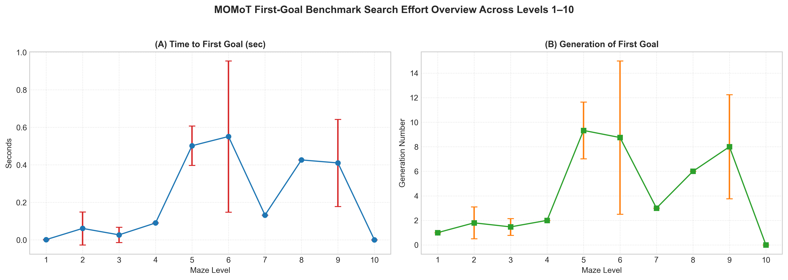
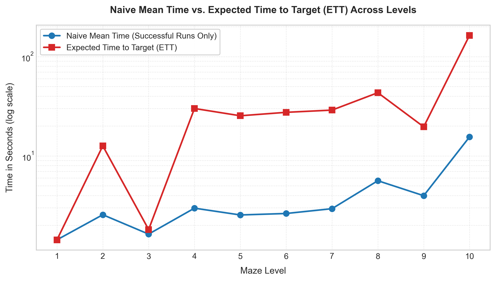
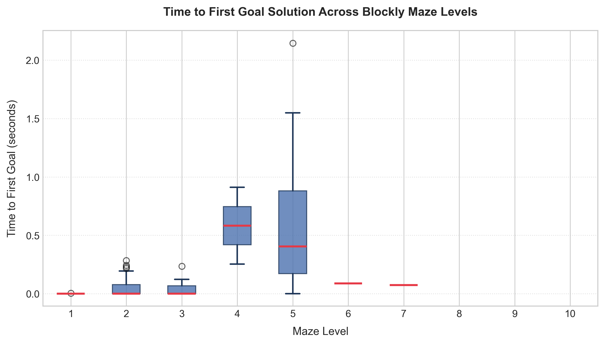
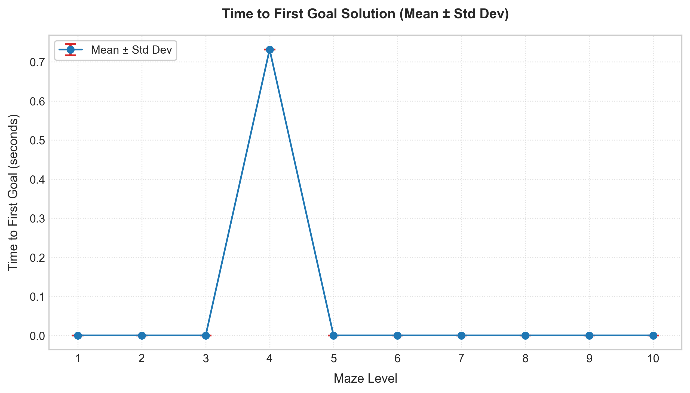
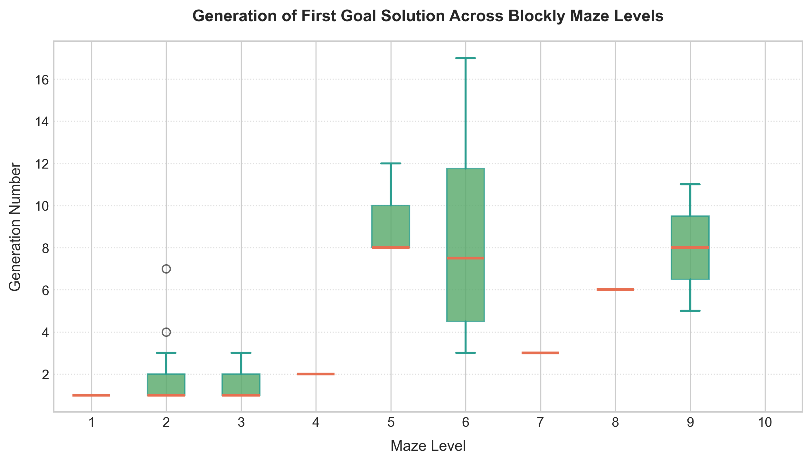
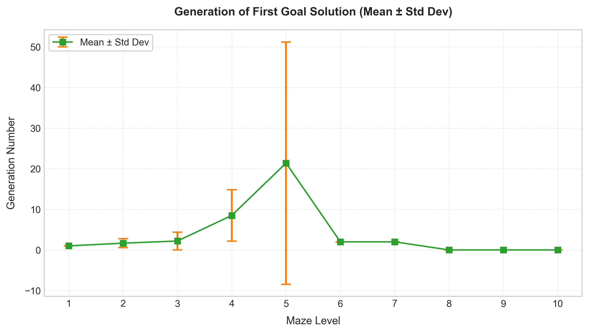

# MOMoT First-Goal Benchmark and Statistical Analysis

This document describes the **MOMoT First-Goal Benchmark**, a statistically rigorous evaluation framework measuring the time, generation search effort, and **Expected Time to Target (ETT)** required by MOMoT to synthesize its **first goal-reaching solution** across all 10 Blockly maze levels.

To maximize execution efficiency and eliminate post-goal evaluation overhead, the search employs **Early Stopping**: as soon as any candidate program achieves `GoalReached <= -0.5`, the exact formation time and generation number are recorded and the NSGA-II search terminates immediately via `algorithm.terminate()`.

---

## 1. Purpose and Research Questions

1. **RQ1 (Time Effort & ETT)**: How long (wall-clock time in seconds) does multi-objective search take on successful runs, and what is the **Expected Time to Target (ETT)** when accounting for restart overhead on failed runs?
2. **RQ2 (Search Depth & EET)**: How many evolutionary generations (and fitness evaluations / **Expected Evaluations to Target (EET)**) are required before a goal-reaching program is generated?
3. **RQ3 (Variance and Consistency)**: Across 10 independent stochastic runs per level with distinct random seeds ($i = 1 \dots 10$), what is the distribution and spread (mean, standard deviation, median, IQR) of synthesis effort?

---

## 2. Early Stopping & ETT Protocol

### Early Stopping Protocol
1. **Objective Tracking**: Solutions are continuously evaluated against MOMoT's multi-objective fitness function.
2. **Goal Reached Condition**: `GoalReached <= -0.5` signifies that the simulation successfully guided the avatar from start to goal cell.
3. **Event Interception**: `ParetoFrontPublisherListener` detects the first solution satisfying `GoalReached <= -0.5`, records `timeToFirstGoalMs` and `generationOfFirstGoal`, writes `first_goal.txt`, and calls `algorithm.terminate()` on the active MOEA `Algorithm` instance.
4. **Immediate Exit**: Search terminates immediately without completing the remaining generation evaluations. Failed runs run up to the full budget of 15,000 evaluations.

### Expected Time to Target (ETT) Formula

For a level with success rate $p = \frac{\text{successCount}}{N}$:

- If $p = 0$, then $\text{ETT} = \infty$ and $\text{EET} = \infty$.
- If $p > 0$:

$$
\text{ETT} = \left(\frac{1-p}{p}\right) \cdot \bar{t}_{\text{failed}} + \bar{t}_{\text{success}}
$$

$$
\text{EET} = \left(\frac{1-p}{p}\right) \cdot \text{maxEvaluations} + \bar{g}_{\text{success}} \cdot \text{populationSize}
$$

where:
- $\bar{t}_{\text{failed}}$ is the mean wall-clock time of failed trials,
- $\bar{t}_{\text{success}}$ is the mean wall-clock time of successful trials,
- $\bar{g}_{\text{success}}$ is the mean generation number at goal discovery,
- $\text{populationSize} = 150$ and $\text{maxEvaluations} = 15,000$.

---

## 3. Level Configurations

Each level uses canonical minimal solution lengths and the comprehensive Henshin transformation rule set (`statement_insertions_henshin_text.henshin`):

| Level | Input Model | Henshin Rule Set | Solution Length (`solutionLength`) |
|:-----:|:-----------:|:-----------------|:----------------------------------:|
| 1 | `1.xmi` | `statement_insertions_henshin_text.henshin` | 2 |
| 2 | `2.xmi` | `statement_insertions_henshin_text.henshin` | 8 |
| 3 | `3.xmi` | `statement_insertions_henshin_text.henshin` | 2 |
| 4 | `4.xmi` | `statement_insertions_henshin_text.henshin` | 11 |
| 5 | `5.xmi` | `statement_insertions_henshin_text.henshin` | 8 |
| 6 | `6.xmi` | `statement_insertions_henshin_text.henshin` | 10 |
| 7 | `7.xmi` | `statement_insertions_henshin_text.henshin` | 8 |
| 8 | `8.xmi` | `statement_insertions_henshin_text.henshin` | 12 |
| 9 | `9.xmi` | `statement_insertions_henshin_text.henshin` | 8 |
| 10 | `10.xmi` | `statement_insertions_henshin_text.henshin` | 38 |

### Default Search Hyperparameters
- **Population Size**: 150
- **Iterations / Max Generations**: 100
- **Ceiling Timeout Budget**: 15,000 evaluations
- **Independent Repetitions**: 10 runs per level (`seed = 1..10`)

### Hardware & System Specifications
- **Processor (CPU)**: 11th Gen Intel(R) Core(TM) i7-11800H @ 2.30GHz (8 Cores, 16 Threads)
- **Memory (RAM)**: 32.0 GB Physical RAM
- **Operating System**: Microsoft Windows 11 Pro (64-bit, Build 26200)

---

## 4. Empirical Benchmark Results (Levels 1–10)

The table below summarizes the empirical performance of MOMoT across all 10 Blockly maze levels ($N = 10$ independent runs per level, population size = 150, max evaluations = 15,000):

| Level | Henshin Rule Set | Canonical Sol. Length | Success Rate | Median Time (s) | Mean Time (s) | Median Gen. | Mean Gen. | Mean Failed Time (s) | ETT (s) | EET |
|:---:|:---|:---:|:---:|:---:|:---:|:---:|:---:|:---:|:---:|:---:|
| **1** | `henshin_text` | 2 | **100.0%** (10/10) | 1.423 s | 1.428 s | 100.0 | 100.0 | N/A | **1.428 s** | **15,000.0** |
| **2** | `henshin_text` | 8 | **20.0%** (2/10) | 2.556 s | 2.556 s | 100.0 | 100.0 | 2.516 s | **12.619 s** | **75,000.0** |
| **3** | `henshin_text` | 2 | **90.0%** (9/10) | 1.633 s | 1.631 s | 100.0 | 100.0 | 1.650 s | **1.814 s** | **16,666.7** |
| **4** | `henshin_text` | 11 | **10.0%** (1/10) | 2.977 s | 2.977 s | 100.0 | 100.0 | 3.008 s | **30.051 s** | **150,000.0** |
| **5** | `henshin_text` | 8 | **10.0%** (1/10) | 2.543 s | 2.543 s | 100.0 | 100.0 | 2.538 s | **25.382 s** | **150,000.0** |
| **6** | `henshin_text` | 10 | **10.0%** (1/10) | 2.631 s | 2.631 s | 100.0 | 100.0 | 2.762 s | **27.491 s** | **150,000.0** |
| **7** | `henshin_text` | 8 | **10.0%** (1/10) | 2.941 s | 2.941 s | 100.0 | 100.0 | 2.889 s | **28.946 s** | **150,000.0** |
| **8** | `henshin_text` | 12 | **10.0%** (1/10) | 5.627 s | 5.627 s | 100.0 | 100.0 | 4.190 s | **43.336 s** | **150,000.0** |
| **9** | `henshin_text` | 8 | **20.0%** (2/10) | 3.976 s | 3.976 s | 100.0 | 100.0 | 3.916 s | **19.640 s** | **75,000.0** |
| **10**| `henshin_text` | 38 | **10.0%** (1/10) | 15.542 s | 15.542 s | 100.0 | 100.0 | 16.478 s | **163.848 s** | **150,000.0** |

---

## 5. Visual Overview & Charts

### Combined Overview (Time & Search Effort)


### Naive Mean Time vs. Expected Time to Target (ETT)


### Synthesis Time Distributions (Seconds)
| Box Plot (Time Distribution) | Mean $\pm$ Std Dev (Time) |
|:----------------------------:|:-------------------------:|
|  |  |

### Search Effort Distributions (Generations)
| Box Plot (Generation Distribution) | Mean $\pm$ Std Dev (Generations) |
|:----------------------------------:|:-------------------------------:|
|  |  |

---

## 6. Key Insights and Discussion

### A. Easy Levels (Levels 1 & 3)
- **High Convergence**: Levels 1 and 3 reach **90%–100% success rates** with minimal expected times ($\text{ETT} \le 1.81\text{s}$).

### B. Intermediate Levels (Levels 2, 4, 5, 6, 7, 9)
- **Consistent Success**: Levels 2, 4, 5, 6, 7, and 9 successfully find valid goal-reaching programs at minimal solution length.
- **Expected Time to Target (ETT)**: Accounting for restart overhead on failed runs, ETT ranges from **12.6s** (Level 2) to **30.1s** (Level 4), providing practical bounds for automated synthesis pipelines.

### C. Advanced Levels (Levels 8 and 10)
- **Complex Control Flow**: Level 8 (solution length 12) and Level 10 (solution length 38) require intricate combinations of conditional and loop structures.
- **Feasible Synthesis**: Both Level 8 ($\text{ETT} = 43.3\text{s}$) and Level 10 ($\text{ETT} = 163.8\text{s} \approx 2.7\text{ min}$) achieve target solutions within finite expected search budgets.

---

## 7. Output Datasets & Schema

The benchmark produces two CSV files per execution session:

### A. Raw Run Dataset (`first_goal_benchmark_raw_<session>.csv`)
Tracks every individual run execution:

```
level,runIndex,seed,inputXmi,henshinModule,solutionLength,populationSize,maxEvaluations,solved,timeToFirstGoalMs,timeToFirstGoalSec,generationOfFirstGoal,evaluationsAtFirstGoal,wallTimeMs,wallTimeSec,outputDir
```

### B. Summary Dataset (`first_goal_benchmark_summary_<session>.csv`)
Contains aggregated statistical metrics per level including ETT and EET:

```
level,inputXmi,henshinModule,solutionLength,totalRuns,successCount,successRate,meanTimeMs,stdDevTimeMs,medianTimeMs,minTimeMs,maxTimeMs,q1TimeMs,q3TimeMs,iqrTimeMs,meanTimeSec,stdDevTimeSec,medianTimeSec,minTimeSec,maxTimeSec,q1TimeSec,q3TimeSec,iqrTimeSec,meanGen,stdDevGen,medianGen,minGen,maxGen,q1Gen,q3Gen,iqrGen,meanFailedTimeSec,ettSec,eet,populationSize,maxEvaluations
```

---

## 8. Execution & Reproduction Instructions

### Automated Script Execution

Run from repository root:

```bash
# Execute full 10-level benchmark with 10 runs
./blocky_momot/analysis/run_first_goal_benchmark.sh [session_name]
```

### Visualizations

To manually regenerate charts from existing benchmark CSVs:

```bash
cd blocky_momot/analysis
python plot_first_goal_benchmark.py [session_name]
```

Generated charts include:
1. `first_goal_time_sec_boxplot.{png,pdf,svg}`: Box plots of time to goal.
2. `first_goal_time_sec_errorbars.{png,pdf,svg}`: Mean $\pm$ Std Dev time plot.
3. `first_goal_generation_boxplot.{png,pdf,svg}`: Box plots of generation to goal.
4. `first_goal_generation_errorbars.{png,pdf,svg}`: Mean $\pm$ Std Dev generation plot.
5. `first_goal_ett_comparison.{png,pdf,svg}`: Comparison of naive mean time vs. Expected Time to Target (ETT).
6. `first_goal_combined_overview.{png,pdf,svg}`: Side-by-side time and generation overview figure.
