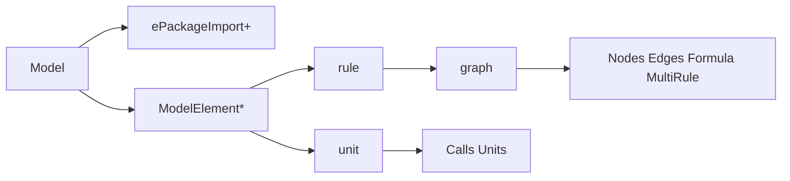

# Henshin_text — Agent Documentation

This folder instructs AI agents how to write **valid, meaningful** `.henshin_text` files for the Eclipse EMF Henshin textural transformation language.

## What is henshin_text?

Henshin_text is a textual DSL for graph transformation rules. Files are transformed into Henshin `.henshin` format and can be executed by the Henshin engine. The language describes:

- **Rules**: Graph transformation rules (LHS/RHS with preserve, create, delete, forbid, require).
- **Units**: Compositions of rule/unit calls (sequential, conditional, independent, priority, iterated, loop).

## File requirements

- **Extension**: Use exactly **`.henshin_text`**. Other extensions are rejected by the tooling.
- **EPackage**: Every file must declare at least one `ePackageImport` so that node types (EClass) and edge types (EReference) can be resolved from an Ecore metamodel.

## Document index

| Document | Content |
|----------|--------|
| [01-file-structure-and-grammar](01-file-structure-and-grammar.md) | Top-level structure, Model, ePackageImport, rule vs unit syntax |
| [02-rules-and-graphs](02-rules-and-graphs.md) | Rules, RuleElements, graph, nodes, edges, action types, attributes |
| [03-units-and-control-flow](03-units-and-control-flow.md) | Units, calls, sequential blocks, independent/conditional/priority/iterated/loop |
| [04-formulas-and-multirules](04-formulas-and-multirules.md) | matchingFormula, conditionGraph, Logic; MultiRule and reuse nodes |
| [05-expressions-and-types](05-expressions-and-types.md) | Expression grammar, parameter types, parameter kinds (IN/OUT/INOUT/VAR) |
| [06-validation-rules](06-validation-rules.md) | Validator constraints: what to do and what to avoid |
| [07-examples-and-patterns](07-examples-and-patterns.md) | Minimal valid examples and pointers to repo examples |
| [08-quick-reference](08-quick-reference.md) | One-page syntax cheat sheet |
| [09-generating-henshin-text](09-generating-henshin-text.md) | **Agent/codegen guide:** ePackageImport, EEnum attributes, delete rules, edges — avoid common errors when generating files |

## High-level structure

- **Model**: One or more `ePackageImport` lines, then zero or more rules and units.
- **Rules** contain exactly one `graph` and optionally javaImport, checkDangling, injectiveMatching, conditions.
- **Units** contain unit elements: calls to rules/units, sequential blocks, and control-flow units (independent, if/then/else, priority, for, while).

- **Agents generating .henshin_text:** Start with [09-generating-henshin-text](09-generating-henshin-text.md) to avoid parse/validation errors (ePackageImport, enums, delete rules, edges). Then use [01-file-structure-and-grammar](01-file-structure-and-grammar.md) and the rest as needed.
- **Otherwise:** Start with [01-file-structure-and-grammar](01-file-structure-and-grammar.md) for the concrete syntax of the file and rules/units, then use the other docs as needed.

## Troubleshooting: "Couldn't resolve reference to EPackage 'blocky'"

This error means the Henshin Text editor cannot find the **blocky** EPackage when resolving `ePackageImport blocky`. The package must be registered in the EMF registry in the running Eclipse. Fix it as follows:

1. **File location**  
   Keep the `.henshin_text` file in the **blocky_model** project (e.g. `blocky_model/transformations/`) so it lives in the same project as `model/blocky.ecore`. If you moved the file to another project, move it back.

2. **Build**  
   In Eclipse: **Project → Build Project** (or **Build All**) so that **blocky_model** is built. The generated code and Ecore registration depend on this.

3. **Register the package** (choose one):
   - **blocky_henshin_fragment (recommended)**  
     The fragment registers the blocky EPackage when the Henshin Text editor runs. Ensure **blocky_henshin_fragment** and **blocky_model** are in your workspace, built, and **included in your Run Configuration** (Run As → Eclipse Application). Open the `.henshin_text` file in that launched Eclipse; the error should go away.
   - **Run with blocky_model**  
     If you run an application that has **blocky_model** (or a plugin that requires it) on the classpath, the package is often registered at startup. Ensure your launch configuration includes the blocky_model plugin (and any workbench startup that registers the package from `blocky_model/model/blocky.ecore`).

4. **After changing anything**  
   If you changed projects, run configuration, or dependencies: do a **clean build** (Project → Clean), then **restart** the Eclipse Application run if you use one. Reopen the `.henshin_text` file.
