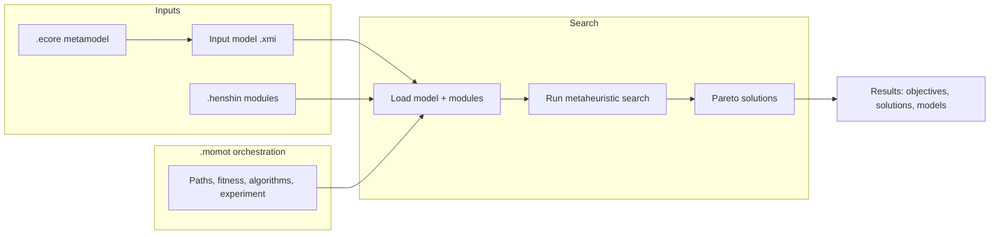

# Overview: MOMoT and file roles

## What MOMoT does

**MOMoT** (**M**arrying **O**ptimization and **M**odel **T**ransformation) combines model-driven engineering with **search-based optimization**. It uses **metaheuristic search** (e.g. NSGA-II, NSGA-III, ε-MOEA) to find good **sequences of model transformations** applied to an initial model, optimizing one or more **objectives** (e.g. coupling, cohesion, solution length).

- The **search space** is the set of sequences of applications of Henshin rules/units.
- The **fitness** is defined by objectives (minimize/maximize) and optional constraints.
- The result is a **Pareto front** of solutions: transformation sequences and the resulting models.

## Role of each file type

### .ecore

- **Purpose:** Defines the **metamodel** of the **models** (input and output). It describes the structure of the instance models (EClasses, EReferences, EAttributes).
- **In .momot:** The .momot file does **not** reference .ecore by path. The **input model** (XMI) must **conform** to an Ecore metamodel.
- **When to register:** If the .momot script uses **domain types** in `adapt` or in fitness expressions (e.g. `root as ClassModel`), the corresponding **Ecore package must be registered** in the `initialization` block (e.g. `MyPackage::eINSTANCE.eClass`). Otherwise loading the model can fail or casts will be invalid.

### .henshin

- **Purpose:** Defines **transformation rules and units** (Henshin module). Rules and composite units are the building blocks of transformation sequences.
- **In .momot:** .henshin is **only referenced by path** in `search.transformations.modules` as a **project-relative path** (e.g. `"transformations/architecture.henshin"`). The .momot file does not define rules; it only points to one or more .henshin module files.
- **Names used in .momot:** Unit names and parameter names (optionally qualified as `ModuleName.UnitName` or `ModuleName.UnitName.ParameterName`) are used in `ignoreUnits`, `ignoreParameters`, and `parameterValues`. These must **exist** in the referenced .henshin modules (validated by the MOMoT validator).

### .momot

- **Purpose:** **Orchestration DSL**: which input model to load, which Henshin modules to use, fitness (objectives/constraints), search algorithms, experiment settings, and how to save analysis and results.
- **Content:** Package, imports, optional variables, optional initialization, **required** search and experiment, optional analysis, results, and finalization. See [02-syntax-and-structure](02-syntax-and-structure.md).

## High-level data flow

- **Input:** Initial model (XMI conforming to an Ecore metamodel) + Henshin module(s).
- **Orchestration:** .momot specifies paths, solution length, fitness, and algorithms.
- **Output:** Pareto-optimal transformation sequences and the resulting models (and optionally analysis outputs).

## Summary table

| File type | Role in MOMoT | Referenced in .momot? |
|-----------|----------------|------------------------|
| .ecore    | Metamodel of models | No (by path). Register package in `initialization` if using domain types. |
| .henshin  | Transformation rules/units | Yes, in `search.transformations.modules` (project-relative path). |
| .momot    | Orchestration (model path, modules, fitness, algorithms, experiment, results) | N/A (this is the orchestration file). |

See [05-ecore-henshin-integration](05-ecore-henshin-integration.md) for paths and how to extract unit/parameter names from .henshin for use in .momot.
